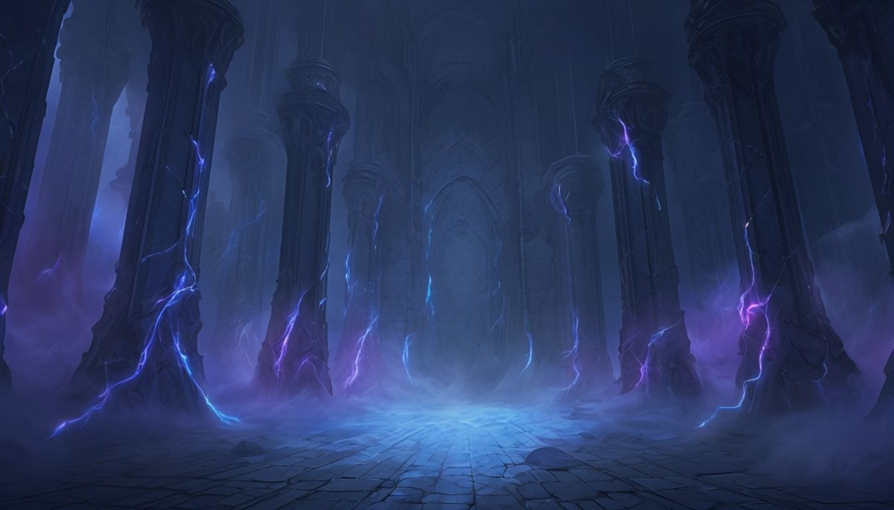

# Eternal Vinny


## 🎬 Demo

<div align="center">

  
  https://github.com/user-attachments/assets/98aeac7a-a015-46ac-8189-8fa89837d9f0

</video>
</div>


Eternal Vinny is an interactive personal portfolio showcasing real-time 3D models and immersive page backgrounds built with Next.js and WebGL. This README is written for visitors, recruiters and other developers so they can quickly understand what the project does, why it exists, and how to run or contribute to it.

Live site: https://eternal-vinny.vercel.app

## Why this project exists

- Demonstrate integration of 3D assets (GLB/GLTF) into a modern React/Next app.
- Showcase responsive design and page-specific visual storytelling.

- 
- Provide a fast, deployable portfolio hosted on Vercel.

Who should look here: recruiters evaluating frontend / WebGL skills, developers learning react-three-fiber, and artists who want a web portfolio for 3D models.

## Quick preview

Hero/background used on the site:


Smaller background examples (these are the same files imported by the app):

| Projects | About | Contact |
|---|---|---|
|  |  |  |

> Note: these images live in `public/background` and are imported by files under `src/app` (see `src/app/page.js` and the `(sub pages)` folder).

## Key features

- Interactive 3D models (GLB/GLTF) rendered in the browser
- Page-specific hero backgrounds and responsive layouts
- Clean, minimal UI with Tailwind CSS
- Fast deployment on Vercel with Next.js app router

## Tech stack

- Next.js (React + App Router)
- React
- Tailwind CSS
- Three.js + @react-three/fiber (3D rendering)
- Vercel (hosting)

## 3D assets included

The repository stores the 3D models used on the site in `public/models`:

- `hat-transformed.glb`
- `mask.glb`
- `shadow-slave-model.glb`
- `staff-transformed.glb`
- `sword.glb`
- `sword2-transformed.glb`
- `wizard-transformed.glb`

These are rendered through the components in `src/app/components/models`.

## Get the project running (local)

PowerShell commands:

```powershell
git clone https://github.com/vinayak746/Eternal-vinny.git
cd Eternal-vinny
npm install
npm run dev
```

Open http://localhost:3000 in your browser.

## Development notes

- Background images are in `public/background` and imported directly in page components.
- 3D models are in `public/models` and loaded with the GLTF loader inside model components.
- If you add new GLB/GLTF files, keep file sizes reasonable for faster load times.

## How to contribute

If you'd like to suggest improvements or submit fixes:

1. Open an issue describing the change or enhancement.
2. Create a branch and submit a pull request.

Small ways to help:

- Add accessibility improvements (alt text, keyboard navigation)
- Reduce large image/model file sizes and optimize for web
- Add tests or CI checks if you modify app behavior

## Suggestions / next improvements

- Add a short GIF or MP4 showing the 3D model interaction in the README header for quicker visual impact.
- Rename or archive the older `website images` folder to reduce confusion.
- Add badges for license or CI when applicable.

## Contact

Built and maintained by Vinayak. Use the site's contact form or open an issue on this repository for direct feedback or collaboration requests.


Thank you for visiting — tell me if you want a GIF, a TOC, or badges for license/CI and I will add them.
## Table of contents

- [Why this project exists](#why-this-project-exists)
- [Quick preview](#quick-preview)
- [Key features](#key-features)
- [Tech stack](#tech-stack)
- [3D assets included](#3d-assets-included)
- [How models are used (example)](#how-models-are-used-example)
- [Get the project running (local)](#get-the-project-running-local)
- [Development notes & optimization](#development-notes--optimization)
- [Accessibility & best practices](#accessibility--best-practices)
- [How to contribute](#how-to-contribute)
- [Roadmap](#roadmap)
- [Contact](#contact)

## How models are used (example)

Below is a short, real example from `src/app/components/models/ShadowSlave.jsx` showing how a GLB is loaded and animated with `@react-three/fiber` + `@react-three/drei` (this is verbatim from the project):

```jsx
"use client";
import React, { useRef } from "react";
import { useGLTF } from "@react-three/drei";
import { useFrame } from "@react-three/fiber";

export default function ShadowSlave(props) {
	const { nodes, materials } = useGLTF("/models/shadow-slave-model.glb");
	const modelRef = useRef();
	useFrame((state) => {
		modelRef.current.position.y =
			-1.5 + Math.sin(state.clock.elapsedTime) * 0.15;
	});
	return (
		<group ref={modelRef} position={[0, -1.5, 0]} scale={[1.67, 1.67, 0.9]}>
			<mesh geometry={nodes.model.geometry} material={materials.model} />
		</group>
	);
}

useGLTF.preload("/models/shadow-slave-model.glb");
```

This demonstrates the project's pattern:

- Put GLB/GLTF files in `public/models` so they are served statically
- Use `useGLTF()` to load models from `/models/<file>.glb`
- Animate or position the model with `useFrame()` and refs

## Development notes & optimization

- Keep 3D model sizes small for fast page loads (compress and decimate meshes where possible).
- Use texture atlases and smaller resolution textures for mobile.
- Preload important models (`useGLTF.preload`) to reduce perceived load time.
- Consider lazy-loading heavy models on scroll or user interaction to improve time-to-first-render.

## Accessibility & best practices

- Add descriptive alt text to images and meaningful aria-labels to interactive controls.
- Ensure contrast and keyboard navigation for interactive parts of the UI.
- Test with Lighthouse for performance and accessibility and iterate on results.

## Roadmap

- Add a short animated GIF demo in the README header (3–5s) — high impact for visitors.
- Add CI (lint/test) and a license file.
- Optimize models and add progressive loading.
- 
## 📄 License

[](https://choosealicense.com/licenses/mit/)

This project is licensed under the MIT License - see the [LICENSE](LICENSE) file for details.

**What this means:**
- ✅ Commercial use allowed
- ✅ Modification allowed
- ✅ Distribution allowed
- ✅ Private use allowed
- ⚠️ Liability and warranty not provided

Copyright © 2025 [Vinayak Arora](https://github.com/vinayak746)

